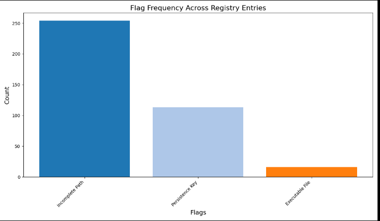

# SoftwareReverseEngineering
## 📖 What is RegDropMap?

RegDropMap is a lightweight forensic tool that parses RegShot compare files, identifies registry-based persistence mechanisms, and visualizes dropped file paths linked to registry keys.

	It is designed to help:
	🕵️ Forensic analysts
	🛡️ Malware researchers
	🔒 Security professionals
 
and to accomplish the following tasks:

	✅ Detect suspicious persistence techniques
	✅ Map malware’s registry-to-file behaviors
	✅ Identify dropped files in unusual or hidden locations (like %Temp%, %AppData%, etc.)
	✅ Automate tedious manual analysis of large diff.txt registry files

## ⚡ Features

Real-world log compatibility — Robust parsing of messy RegShot outputs

Automatic Flagging — Highlights suspicious behaviors (e.g., Suspicious Folder, Incomplete Path)

Visualizations — Generate clear and insightful:

	📊 Flag frequency charts
	
	🥧 Folder-based risk pie charts
	
	🔗 Interactive Sankey diagrams (Registry ➔ Dropped File flow)
	
	🕸️ Network graphs of persistence links

Extensible & Scriptable — Modular structure for easy upgrades

## 🛠️ Installation

	Clone the repository:
		git clone https://github.com/SaiVSrini/SoftwareReverseEngineering.git
		cd SoftwareReverseEngineering/RegDropMap
	Install required Python libraries:
		pip install -r requirements.txt

## 📂 Project Structure

	RegDropMap/
	├── regdropmap.py       # Main script
	├── utils/
	│   ├── parser.py       # Parse RegShot diff.txt
	│   ├── analyzer.py     # Flag suspicious persistence entries
	│   ├── visualizer.py   # Generate visual outputs
	├── requirements.txt    # Dependencies
	├── output/             # Saved visualizations
	└── README.md           # Project documentation

 ## 🚀 Usage

 	Run the tool:
  	python regdropmap.py -i path/to/compare.txt -o output_folder --verbose
   
   	Argument | Description
	-i / --input | Path to RegShot diff.txt file (required)
	-o / --output | Output folder for generated graphs (optional, defaults to output/)
	--verbose | Enable detailed console output (optional)
 
## 🧩 Module Descriptions

 	    Module    | Purpose   |
	parser.py     | Parses RegShot output and extracts meaningful registry entries
	analyzer.py   | Flags suspicious entries based on folder paths, missing data, etc.
	visualizer.py | Draws graphs, pie charts, bar charts, and Sankey diagrams
	regdropmap.py | Main controller to parse → analyze → visualize the data

 ## 📈 Outputs

  	flag_frequency.png — Frequency of detected flags

	suspicious_folder_pie.png — Dropped files: Suspicious vs Normal folders

	persistence_graph.png — Registry key ➔ Dropped file flow (Graph)

	persistence_sankey.html — Interactive Sankey Diagram (HTML)

## 📈 Future Scope

	🧹 Cleaner Graph Layouts — Make large graphs easier to read with better layouts, node grouping, and smarter spacing.

  	🧠 AI-Powered Analysis — Use machine learning to automatically flag suspicious registry patterns and prioritize critical changes.

   	🌐 Web Dashboard Integration — Create a fully interactive web app version with dynamic graph exploration and reporting.

	🎯 Threat Intelligence Scoring — Automatically assign risk scores to registry entries based on known malware behaviors and heuristics.

	🧩 Plugin System — Allow users to add custom detection rules or output formats via an easy plugin architecture.

 ## Visualizations
 ### Flag Frequency Chart

  	
 	

